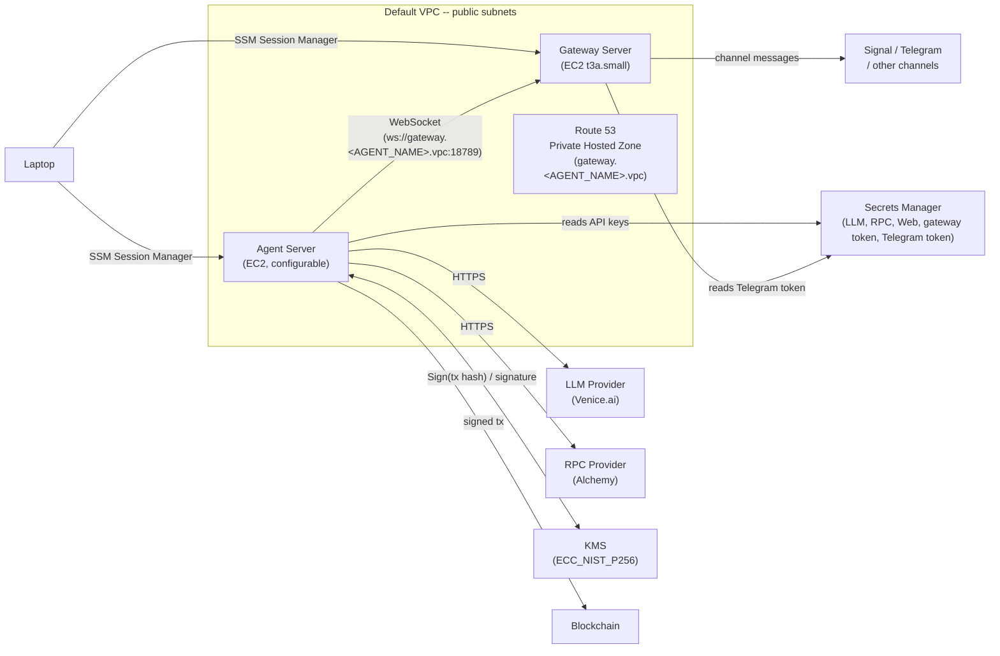

# OpenClaw Safe Agent Infrastructure

Secure AWS infrastructure for running an OpenClaw agent using AWS CDK. Protects the Starknet wallet private key (via KMS), API keys and channel credentials (via Secrets Manager with per-server IAM scoping) so that even a compromised agent cannot extract the wallet key.

## Architecture



## Packages

| Package | Description |
|---|---|
| [`packages/cdk`](packages/cdk/) | AWS CDK stack -- EC2 instances, IAM roles, KMS, Secrets Manager, Route 53, security groups |
| [`packages/shared`](packages/shared/) | Internal AWS utilities -- client creation, SSM commands, instance discovery, cloud-init readiness |
| [`packages/integration`](packages/integration/) | Integration test suite -- runs against deployed stack via SSM |

## Prerequisites

* [AWS CLI](https://docs.aws.amazon.com/cli/latest/userguide/getting-started-install.html) configured with credentials
* [Node.js](https://nodejs.org/) (v18+)
* [AWS CDK CLI](https://docs.aws.amazon.com/cdk/v2/guide/cli.html) (`npm install -g aws-cdk`)
* [Session Manager plugin](https://docs.aws.amazon.com/systems-manager/latest/userguide/session-manager-working-with-install-plugin.html) for connecting to EC2 instances

### Install AWS CLI

**macOS (Homebrew):**

```bash
brew install awscli
```

**Linux:**

```bash
curl "https://awscli.amazonaws.com/awscli-exe-linux-x86_64.zip" -o "awscliv2.zip"
unzip awscliv2.zip
sudo ./aws/install
```

**Verify installation and configure credentials:**

```bash
aws --version
aws configure
```

You'll need an IAM user Access Key ID and Secret Access Key -- generate these from the [IAM Console](https://console.aws.amazon.com/iam/) under **Users > Security credentials > Create access key**.

### Install Session Manager plugin

**macOS (Apple Silicon):**

```bash
curl "https://s3.amazonaws.com/session-manager-downloads/plugin/latest/mac_arm64/session-manager-plugin.pkg" -o "session-manager-plugin.pkg"
sudo installer -pkg session-manager-plugin.pkg -target /
```

**macOS (Intel):**

```bash
curl "https://s3.amazonaws.com/session-manager-downloads/plugin/latest/mac/session-manager-plugin.pkg" -o "session-manager-plugin.pkg"
sudo installer -pkg session-manager-plugin.pkg -target /
```

**Linux (Debian/Ubuntu):**

```bash
curl "https://s3.amazonaws.com/session-manager-downloads/plugin/latest/ubuntu_64bit/session-manager-plugin.deb" -o "session-manager-plugin.deb"
sudo dpkg -i session-manager-plugin.deb
```

## Setup

```bash
git clone <repo-url>
cd safe-aws-agent-infra
npm install
cp .env.example .env
```

### Choose a messaging channel

Your agent needs a messaging channel so you can talk to it. OpenClaw supports both Telegram and Signal. Choose one before deploying:

| | Telegram (default) | Signal |
|---|---|---|
| **Setup time** | ~2 minutes | ~10-15 minutes |
| **Extra phone number required** | No | Yes (dedicated number) |
| **End-to-end encryption** | No -- Telegram servers can see bot messages | Yes -- messages are E2E encrypted |
| **What the provider sees** | All messages between you and the bot | Nothing (encrypted end-to-end) |
| **Best for** | Quick setup, general use | Privacy-sensitive use (wallet ops, financial data) |

**Recommendation:** Use Telegram to get started quickly. Choose Signal if your agent handles sensitive data and you need E2E encryption.

**If using Telegram**, create a bot now:

1. Open Telegram on your phone or desktop
2. Search for `@BotFather` (verified Telegram system account)
3. Send `/newbot`
4. Follow the prompts -- choose a display name and a username (must end in `bot`)
5. BotFather replies with your bot token (a string like `123456:ABC-DEF1234ghIkl-zyx57W2v1u123ew11`)
6. Copy the token -- you'll add it to `.env` below

**If using Signal**, skip this step -- Signal setup happens post-deploy on the Gateway Server.

### Configure .env

Edit `.env` and configure:

```
# Required: unique name for this agent (lowercase alphanumeric + hyphens, starts with letter, max 20 chars)
AGENT_NAME=alice

# Required: availability zone to deploy in
CDK_AZ=us-east-1a

# LLM Provider (required)
LLM_PROVIDER=venice
LLM_API_KEY=sk-...

# RPC Provider (optional, for Starknet on-chain access)
RPC_PROVIDER=alchemy
RPC_API_KEY=abc123...

# Web search provider (required)
# Supported: brave, gemini, grok, kimi, perplexity
WEB_SEARCH_PROVIDER=brave
WEB_SEARCH_API_KEY=...

# Telegram bot token (optional, only if using Telegram)
TELEGRAM_BOT_TOKEN=123456:ABC-DEF1234ghIkl-zyx57W2v1u123ew11
```

`AGENT_NAME` scopes all AWS resources (secrets, DNS, KMS tags, SSM document) so multiple agents can coexist in the same account and region. The region is derived automatically from the AZ (e.g., `us-east-1a` becomes `us-east-1`).

## Deploy

Bootstrap CDK (first time only, per account/region):

```bash
npx cdk bootstrap
```

Deploy the stack:

```bash
npx cdk deploy
```

CDK will show the resources to be created and ask for confirmation. After deployment, the stack outputs will display:

* **AgentServerInstanceId** -- Agent Server EC2 instance ID
* **GatewayServerInstanceId** -- Gateway Server EC2 instance ID
* **GatewayServerPrivateIp** -- Gateway Server private IP (agent connects via `ws://gateway.<AGENT_NAME>.vpc:18789`)

## Connect to instances

Use SSM Session Manager (no SSH keys needed):

```bash
# Connect to the Agent Server EC2
aws ssm start-session --target <AgentServerInstanceId> --document-name <AGENT_NAME>

# Connect to the Gateway Server EC2
aws ssm start-session --target <GatewayServerInstanceId> --document-name <AGENT_NAME>
```

## Tear down

**WARNING:** Destroying the stack will permanently delete the KMS wallet key. Any Starknet funds controlled by that key will be permanently inaccessible. Make sure you have transferred all funds before destroying the stack.

```bash
npx cdk destroy
```

## OpenClaw Setup

After deployment, the gateway and agent servers need manual configuration.

### Gateway Server

Login to the gateway server

```bash
pnpm run login:gateway
```

Configure the gateway with token auth and LAN binding

```bash
openclaw onboard --non-interactive --accept-risk \
  --flow quickstart --gateway-bind lan --skip-daemon
```

#### Configure your messaging channel

Choose **Option A** (Telegram) or **Option B** (Signal) based on the channel you picked during pre-deploy setup.

#### Option A: Telegram

Configure the Telegram bot token by running `openclaw secrets configure` and following the prompts:

1. **Provider setup** -- add a new provider:
   - Name: `telegram`
   - Source: `exec`
   - Command: `/usr/local/bin/aws`
   - Args: `secretsmanager get-secret-value --secret-id <AGENT_NAME>/telegram-token --query SecretString --output text`
   - passEnv: `HOME`
   - jsonOnly: `false`

2. **Credential mapping** -- select "Continue" from the provider menu, then:
   - Select `channels.telegram.botToken` from the credential list
   - Source: `exec`
   - Provider: `telegram`
   - Secret ID: `value`

3. **Apply** the plan

> The Telegram bot token is stored in AWS Secrets Manager and fetched at runtime via the instance IAM role. It never touches disk on the Gateway Server.

Find your Telegram user ID (needed for the allowlist):

1. Search for `@userinfobot` in Telegram and start a chat
2. It replies with your numeric user ID (e.g., `123456789`)

Configure the channel:

```bash
openclaw channels add --channel telegram
openclaw config set channels.telegram.dmPolicy allowlist
openclaw config set channels.telegram.allowFrom '["<TELEGRAM_USER_ID>"]'
openclaw config set session.dmScope per-channel-peer
```

#### Option B: Signal (E2E encrypted alternative)

Signal requires a **dedicated phone number** -- you cannot reuse your personal Signal number. You will need a spare SIM card or VoIP number.

Open this [link](https://signalcaptchas.org/registration/generate.html) in your browser to resolve Signal's CAPTCHA, copy the token and register:

```bash
signal-cli -u <PHONE_NUMBER> register --captcha "<CAPTCHA_TOKEN>"
signal-cli -u <PHONE_NUMBER> verify <SMS_CODE>
```

Configure the channel:

```bash
openclaw channels add --channel signal --account <PHONE_NUMBER>
openclaw config set channels.signal.dmPolicy allowlist
openclaw config set channels.signal.allowFrom '["<OWNER_PHONE_NUMBER>"]'
openclaw config set session.dmScope per-channel-peer
```

#### Gateway token and service

Copy the auto-generated gateway token and store it in Secrets Manager so the Agent Server can authenticate

```bash
openclaw config get gateway.auth.token
aws secretsmanager put-secret-value --secret-id <AGENT_NAME>/gateway-token --secret-string "<GATEWAY_TOKEN>"
```

Install and start the gateway service

```bash
openclaw gateway install
openclaw gateway start
systemctl --user enable openclaw-gateway.service
```

### Agent Server

Login to the agent server

```bash
pnpm run login:agent
```

Configure OpenClaw with Venice.ai

```bash
openclaw onboard --non-interactive --accept-risk \
  --mode remote --remote-url "ws://gateway.<AGENT_NAME>.vpc:18789" \
  --auth-choice venice \
  --model "venice/zai-org-glm-5" \
  --skip-channels --skip-skills --skip-daemon
```

Configure image and fallback models

```bash
openclaw models set-image venice/kimi-k2-5
openclaw config set agents.defaults.model.fallbacks '["venice/minimax-m25"]'
```

Configure the LLM API key by running `openclaw secrets configure` and following the prompts:

1. **Provider setup** -- add a new provider:
   - Name: `llm`
   - Source: `exec`
   - Command: `/usr/local/bin/aws`
   - Args: `secretsmanager get-secret-value --secret-id <AGENT_NAME>/llm-api-key --query SecretString --output text`
   - passEnv: `HOME`
   - jsonOnly: `false`

2. **Credential mapping** -- select "Continue" from the provider menu, then:
   - Select `models.providers.venice.apiKey` from the credential list
   - Source: `exec`
   - Provider: `llm`
   - Secret ID: `value`

3. **Apply** the plan

> The LLM API key is stored in AWS Secrets Manager and fetched at runtime via the instance IAM role. It never touches disk on the Agent Server.

Configure the gateway token by running `openclaw secrets configure` and following the prompts:

1. **Provider setup** -- add a new provider:
   - Name: `gateway-token`
   - Source: `exec`
   - Command: `/usr/local/bin/aws`
   - Args: `secretsmanager get-secret-value --secret-id <AGENT_NAME>/gateway-token --query SecretString --output text`
   - passEnv: `HOME`
   - jsonOnly: `false`

2. **Credential mapping** -- select "Continue" from the provider menu, then:
   - Select `gateway.remote.token` from the credential list
   - Source: `exec`
   - Provider: `gateway-token`
   - Secret ID: `value`

3. **Apply** the plan

> The gateway token is stored in AWS Secrets Manager and fetched at runtime via the instance IAM role. It never touches disk on the Agent Server.

Configure web search by running `openclaw secrets configure` and following the prompts:

1. **Provider setup** -- add a new provider:
   - Name: `web`
   - Source: `exec`
   - Command: `/usr/local/bin/aws`
   - Args: `secretsmanager get-secret-value --secret-id <AGENT_NAME>/web-search-api-key --query SecretString --output text`
   - passEnv: `HOME`
   - jsonOnly: `false`

2. **Credential mapping** -- select "Continue" from the provider menu, then:
   - Select `tools.web.search.apiKey` from the credential list (for Brave; other providers use `tools.web.search.<provider>.apiKey`)
   - Source: `exec`
   - Provider: `web`
   - Secret ID: `value`

3. **Apply** the plan

> The web search API key is stored in AWS Secrets Manager and fetched at runtime via the instance IAM role. It never touches disk.

Start the agent

```bash
openclaw agent
```

Where:

* `<TELEGRAM_USER_ID>` -- your Telegram numeric user ID from @userinfobot (e.g. `123456789`)
* `<PHONE_NUMBER>` -- dedicated bot phone number in E.164 format (e.g. `+33612345678`) (Signal only)
* `<CAPTCHA_TOKEN>` -- token from the captcha page (Signal only)
* `<SMS_CODE>` -- verification code received via SMS (Signal only)
* `<OWNER_PHONE_NUMBER>` -- your personal phone number (the only number allowed to message the bot) (Signal only)
* `<GATEWAY_TOKEN>` -- auto-generated token from `openclaw config get gateway.auth.token` on the Gateway Server
