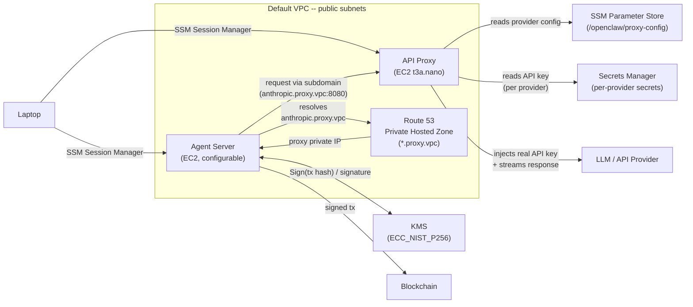

# OpenClaw Safe Agent Infrastructure

Secure AWS infrastructure for running an OpenClaw agent using AWS CDK. Protects the Starknet wallet private key (via KMS) and provider API keys (via Secrets Manager) so that even a compromised agent cannot extract them.

## Architecture



## Packages

| Package | Description |
|---|---|
| [`packages/cdk`](packages/cdk/) | AWS CDK stack -- EC2 instances, IAM roles, KMS, Secrets Manager, Route 53, security groups |
| [`packages/proxy`](packages/proxy/) | HTTP proxy that injects API keys from Secrets Manager using subdomain-based routing |

For components, security boundaries, design decisions, supported providers, and operational guides (key rotation, adding providers), see the [CDK package README](packages/cdk/README.md). For proxy internals (routing, injection methods, configuration), see the [proxy package README](packages/proxy/README.md).

## Prerequisites

* [AWS CLI](https://docs.aws.amazon.com/cli/latest/userguide/getting-started-install.html) configured with credentials
* [Node.js](https://nodejs.org/) (v18+)
* [AWS CDK CLI](https://docs.aws.amazon.com/cdk/v2/guide/cli.html) (`npm install -g aws-cdk`)
* [Session Manager plugin](https://docs.aws.amazon.com/systems-manager/latest/userguide/session-manager-working-with-install-plugin.html) for connecting to EC2 instances

### Install AWS CLI

**macOS (Homebrew):**

```bash
brew install awscli
```

**Linux:**

```bash
curl "https://awscli.amazonaws.com/awscli-exe-linux-x86_64.zip" -o "awscliv2.zip"
unzip awscliv2.zip
sudo ./aws/install
```

**Verify installation and configure credentials:**

```bash
aws --version
aws configure
```

You'll need an IAM user Access Key ID and Secret Access Key -- generate these from the [IAM Console](https://console.aws.amazon.com/iam/) under **Users > Security credentials > Create access key**.

### Install Session Manager plugin

**macOS (Apple Silicon):**

```bash
curl "https://s3.amazonaws.com/session-manager-downloads/plugin/latest/mac_arm64/session-manager-plugin.pkg" -o "session-manager-plugin.pkg"
sudo installer -pkg session-manager-plugin.pkg -target /
```

**macOS (Intel):**

```bash
curl "https://s3.amazonaws.com/session-manager-downloads/plugin/latest/mac/session-manager-plugin.pkg" -o "session-manager-plugin.pkg"
sudo installer -pkg session-manager-plugin.pkg -target /
```

**Linux (Debian/Ubuntu):**

```bash
curl "https://s3.amazonaws.com/session-manager-downloads/plugin/latest/ubuntu_64bit/session-manager-plugin.deb" -o "session-manager-plugin.deb"
sudo dpkg -i session-manager-plugin.deb
```

## Setup

```bash
git clone <repo-url>
cd safe-aws-agent-infra
npm install
cp .env.example .env
```

Edit `.env` and set the API keys for the providers you use:

```
ANTHROPIC_API_KEY=sk-ant-...
OPENAI_API_KEY=sk-...
```

Only providers with a key set in `.env` will be deployed. See `.env.example` for the full list and the [CDK README](packages/cdk/) for all supported providers.

## Deploy

Bootstrap CDK (first time only, per account/region):

```bash
npx cdk bootstrap
```

Deploy the stack:

```bash
npx cdk deploy
```

CDK will show the resources to be created and ask for confirmation. After deployment, the stack outputs will display:

* **AgentInstanceId** -- Agent EC2 instance ID
* **ProxyInstanceId** -- Proxy EC2 instance ID
* **ProxyPrivateIp** -- Proxy private IP (the agent can also reach the proxy via `http://proxy.vpc:8080` or per-provider subdomains like `http://anthropic.proxy.vpc:8080`)
* **WalletKeyArn** -- KMS key ARN for signing
* **ProxyConfigParameter** -- SSM Parameter name for the proxy provider mapping

## Connect to instances

Use SSM Session Manager (no SSH keys needed):

```bash
# Connect to the Agent EC2
aws ssm start-session --target <AgentInstanceId>

# Connect to the Proxy EC2
aws ssm start-session --target <ProxyInstanceId>
```

## Tear down

**WARNING:** Destroying the stack will permanently delete the KMS wallet key. Any Starknet funds controlled by that key will be permanently inaccessible. Make sure you have transferred all funds before destroying the stack.

```bash
npx cdk destroy
```
