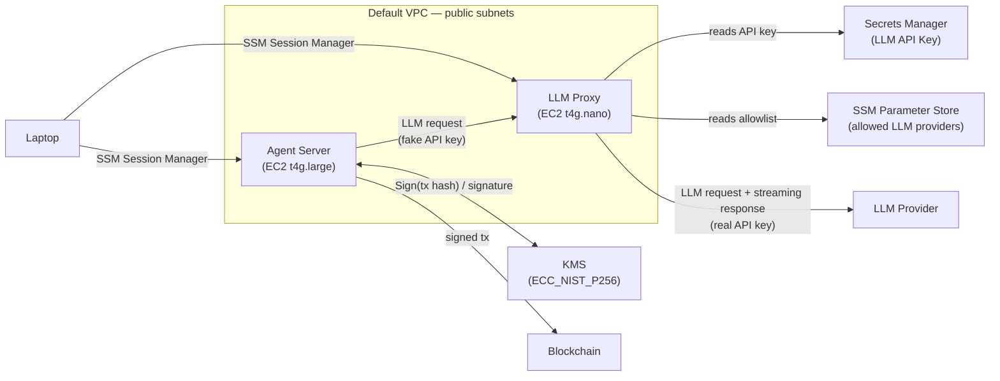

# OpenClaw Safe Agent Infrastructure

Secure AWS infrastructure for running an OpenClaw agent using AWS CDK. Protects the Starknet wallet private key (via KMS) and the LLM API key (via Secrets Manager) so that even a compromised agent cannot extract them.

## Architecture

### Network & Data Flow



### Components

| Component | AWS Service | Purpose | Why this service |
|---|---|---|---|
| Agent Server | EC2 (t4g.large, 30 GB EBS, Amazon Linux 2023) | Runs OpenClaw + agents | Long-running process needs a persistent server; t4g.large balances cost and performance for agent workloads; Amazon Linux 2023 includes SSM agent pre-installed |
| LLM Proxy | EC2 (t4g.nano, Amazon Linux 2023) | Swaps fake API key for real key, streams LLM responses back to agent | Dedicated instance provides hard IAM boundary from agent; supports streaming (SSE) which Lambda cannot; ~$1.50/month; Amazon Linux 2023 includes SSM agent pre-installed |
| Remote Access | SSM Session Manager | Shell access to both EC2 instances without open ports | No inbound ports, no SSH keys to manage, IAM-based access control, full session audit via CloudTrail |
| Wallet Key | KMS (ECC_NIST_P256) | Starknet secp256r1 signing — private key never leaves HSM | Hardware-backed key that supports `Sign` API; key material is non-extractable by design |
| LLM API Key | Secrets Manager | Stores the real LLM provider API key | Encrypted at rest, fine-grained IAM access, supports rotation; only the Proxy EC2 can read it |
| Allowed LLM Providers | SSM Parameter Store (StringList) | Allowlist of LLM provider domains the proxy may forward to | Free, not a secret, readable by the proxy at startup; add or remove providers without redeploying code |
| Network | Default VPC, public subnets | Hosts both EC2 instances | No custom VPC or NAT Gateway needed; security comes from IAM/KMS boundaries and security groups (no inbound rules), not network isolation |

### Security Boundaries

* Agent never sees the real LLM API key — it sends a fake key to the proxy, which swaps it for the real one
* Agent never sees private key material — signs via KMS `Sign` API only
* **Agent EC2 IAM role** grants: `kms:Sign` on the wallet key + `AmazonSSMManagedInstanceCore` managed policy
* **Proxy EC2 IAM role** grants: `secretsmanager:GetSecretValue` on the LLM API key secret + `ssm:GetParameter` on the allowed providers parameter + `AmazonSSMManagedInstanceCore` managed policy
* Proxy only forwards requests to domains listed in the SSM allowlist — rejects all other destinations
* Separate EC2 instances = separate IAM roles — even a fully compromised agent cannot call Secrets Manager
* Proxy security group: inbound only from Agent EC2 security group on the proxy port; outbound HTTPS (443) for reaching the LLM provider
* Agent security group: no inbound from internet; outbound HTTPS (443) broadly — the agent needs internet access to be useful; secrets are protected by IAM/KMS boundaries, not network restrictions

### Design Decisions

* **EC2 proxy instead of Lambda** — OpenClaw hardcodes `stream: true` for LLM requests (SSE). Lambda cannot stream responses back to the caller in a standard invocation. A dedicated EC2 instance supports streaming natively and provides a hard IAM-level security boundary without requiring Docker on the agent host.
* **SSM instead of SSH** — No inbound ports, no key management, IAM-controlled access, CloudTrail audit trail.
* **KMS key instead of Secrets Manager for the wallet** — KMS `Sign` API lets the agent sign transactions without ever accessing key material. A Secrets Manager secret would require fetching the raw private key into the agent's memory.
* **Broad HTTPS egress for Agent EC2** — Restricting the agent to specific IPs would limit its usefulness. The security model relies on IAM and KMS boundaries to protect secrets, not on network egress filtering. The agent has no IAM access to Secrets Manager, and the private key never leaves KMS.
* **Transaction guardrails on-chain, not in AWS** — KMS signs whatever hash is sent to it and cannot judge transaction intent. Instead of CloudTrail alerting (which only detects after the fact), spending limits, whitelisted addresses, rate limits, and time locks are enforced at the Starknet account contract level. This prevents malicious transactions at the protocol level even if the agent and KMS are fully compromised.
* **Default VPC with public subnets, no NAT Gateway** — Private subnets + NAT Gateway add ~$32/month and complexity for minimal security benefit. Our security model relies on IAM roles and KMS, not network isolation. Security groups with no inbound rules make the instances unreachable from the internet. Outbound internet works directly without a NAT Gateway.

## Prerequisites

* [AWS CLI](https://docs.aws.amazon.com/cli/latest/userguide/getting-started-install.html) configured with credentials
* [Node.js](https://nodejs.org/) (v18+)
* [AWS CDK CLI](https://docs.aws.amazon.com/cdk/v2/guide/cli.html) (`npm install -g aws-cdk`)
* [Session Manager plugin](https://docs.aws.amazon.com/systems-manager/latest/userguide/session-manager-working-with-install-plugin.html) for connecting to EC2 instances

### Install AWS CLI

**macOS (Homebrew):**

```bash
brew install awscli
```

**Linux:**

```bash
curl "https://awscli.amazonaws.com/awscli-exe-linux-x86_64.zip" -o "awscliv2.zip"
unzip awscliv2.zip
sudo ./aws/install
```

**Verify installation and configure credentials:**

```bash
aws --version
aws configure
```

You'll need an IAM user Access Key ID and Secret Access Key — generate these from the [IAM Console](https://console.aws.amazon.com/iam/) under **Users → Security credentials → Create access key**.

### Install Session Manager plugin

**macOS (Apple Silicon):**

```bash
curl "https://s3.amazonaws.com/session-manager-downloads/plugin/latest/mac_arm64/session-manager-plugin.pkg" -o "session-manager-plugin.pkg"
sudo installer -pkg session-manager-plugin.pkg -target /
```

**macOS (Intel):**

```bash
curl "https://s3.amazonaws.com/session-manager-downloads/plugin/latest/mac/session-manager-plugin.pkg" -o "session-manager-plugin.pkg"
sudo installer -pkg session-manager-plugin.pkg -target /
```

**Linux (Debian/Ubuntu):**

```bash
curl "https://s3.amazonaws.com/session-manager-downloads/plugin/latest/ubuntu_64bit/session-manager-plugin.deb" -o "session-manager-plugin.deb"
sudo dpkg -i session-manager-plugin.deb
```

## Setup

```bash
git clone <repo-url>
cd safe-aws-agent-infra
npm install
cp .env.example .env
```

Edit `.env` and set your LLM API key:

```
LLM_API_KEY=your-actual-api-key
```

## Deploy

Bootstrap CDK (first time only, per account/region):

```bash
npx cdk bootstrap
```

Deploy the stack:

```bash
npx cdk deploy
```

CDK will show the resources to be created and ask for confirmation. After deployment, the stack outputs will display:

* **AgentInstanceId** — Agent EC2 instance ID
* **ProxyInstanceId** — Proxy EC2 instance ID
* **ProxyPrivateIp** — Proxy private IP (configure agent LLM endpoint as `http://<ip>:8080`)
* **WalletKeyArn** — KMS key ARN for signing
* **LlmApiKeySecretArn** — Secrets Manager ARN
* **AllowedLlmProvidersParameter** — SSM Parameter name for the provider allowlist

## Connect to instances

Use SSM Session Manager (no SSH keys needed):

```bash
# Connect to the Agent EC2
aws ssm start-session --target <AgentInstanceId>

# Connect to the Proxy EC2
aws ssm start-session --target <ProxyInstanceId>
```

## Supported LLM providers

The proxy allows requests to the following OpenClaw-supported provider domains (stored as an SSM StringList parameter):

| Provider | Domain |
|---|---|
| OpenAI | `api.openai.com` |
| Anthropic | `api.anthropic.com` |
| Google Gemini | `generativelanguage.googleapis.com` |
| Mistral | `api.mistral.ai` |
| Groq | `api.groq.com` |
| xAI | `api.x.ai` |
| OpenRouter | `openrouter.ai` |
| Venice | `api.venice.ai` |
| Cerebras | `api.cerebras.ai` |

**Add or remove providers after deployment:**

```bash
aws ssm put-parameter \
  --name /openclaw/allowed-llm-providers \
  --type StringList \
  --value "api.openai.com,api.anthropic.com,api.venice.ai" \
  --overwrite
```

Then restart the proxy process to pick up the new list.

## Rotate the LLM API key

```bash
aws secretsmanager put-secret-value \
  --secret-id openclaw/llm-api-key \
  --secret-string "new-api-key-here"
```

Then restart the proxy process to pick up the new key.

Alternatively, update `.env` and run `npx cdk deploy` to update the API key via CDK.

## Tear down

**WARNING:** Destroying the stack will permanently delete the KMS wallet key. Any Starknet funds controlled by that key will be permanently inaccessible. Make sure you have transferred all funds before destroying the stack.

```bash
npx cdk destroy
```
