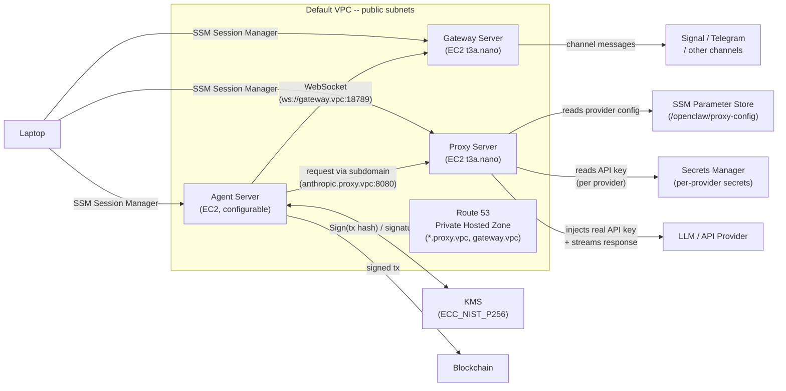

# OpenClaw Safe Agent Infrastructure

Secure AWS infrastructure for running an OpenClaw agent using AWS CDK. Protects the Starknet wallet private key (via KMS), provider API keys (via Secrets Manager), and channel credentials (via gateway server isolation) so that even a compromised agent cannot extract them.

## Architecture



## Packages

| Package | Description |
|---|---|
| [`packages/cdk`](packages/cdk/) | AWS CDK stack -- EC2 instances, IAM roles, KMS, Secrets Manager, Route 53, security groups |
| [`packages/proxy`](packages/proxy/) | HTTP proxy that injects API keys from Secrets Manager using subdomain-based routing |

For components, security boundaries, design decisions, supported providers, and operational guides (key rotation, adding providers), see the [CDK package README](packages/cdk/README.md). For proxy internals (routing, injection methods, configuration), see the [proxy package README](packages/proxy/README.md).

## Prerequisites

* [AWS CLI](https://docs.aws.amazon.com/cli/latest/userguide/getting-started-install.html) configured with credentials
* [Node.js](https://nodejs.org/) (v18+)
* [AWS CDK CLI](https://docs.aws.amazon.com/cdk/v2/guide/cli.html) (`npm install -g aws-cdk`)
* [Session Manager plugin](https://docs.aws.amazon.com/systems-manager/latest/userguide/session-manager-working-with-install-plugin.html) for connecting to EC2 instances

### Install AWS CLI

**macOS (Homebrew):**

```bash
brew install awscli
```

**Linux:**

```bash
curl "https://awscli.amazonaws.com/awscli-exe-linux-x86_64.zip" -o "awscliv2.zip"
unzip awscliv2.zip
sudo ./aws/install
```

**Verify installation and configure credentials:**

```bash
aws --version
aws configure
```

You'll need an IAM user Access Key ID and Secret Access Key -- generate these from the [IAM Console](https://console.aws.amazon.com/iam/) under **Users > Security credentials > Create access key**.

### Install Session Manager plugin

**macOS (Apple Silicon):**

```bash
curl "https://s3.amazonaws.com/session-manager-downloads/plugin/latest/mac_arm64/session-manager-plugin.pkg" -o "session-manager-plugin.pkg"
sudo installer -pkg session-manager-plugin.pkg -target /
```

**macOS (Intel):**

```bash
curl "https://s3.amazonaws.com/session-manager-downloads/plugin/latest/mac/session-manager-plugin.pkg" -o "session-manager-plugin.pkg"
sudo installer -pkg session-manager-plugin.pkg -target /
```

**Linux (Debian/Ubuntu):**

```bash
curl "https://s3.amazonaws.com/session-manager-downloads/plugin/latest/ubuntu_64bit/session-manager-plugin.deb" -o "session-manager-plugin.deb"
sudo dpkg -i session-manager-plugin.deb
```

## Setup

```bash
git clone <repo-url>
cd safe-aws-agent-infra
npm install
cp .env.example .env
```

Edit `.env` and configure the availability zones and API keys:

```
# Required: production and test availability zones (must be in DIFFERENT regions)
CDK_AZ_PROD=us-east-1a
CDK_AZ_TEST=us-east-2a

# API keys for the providers you use
ANTHROPIC_API_KEY=sk-ant-...
OPENAI_API_KEY=sk-...
```

Both `CDK_AZ_PROD` and `CDK_AZ_TEST` are required. The region is derived automatically from the AZ (e.g., `us-east-1a` becomes `us-east-1`). The prod and test AZs **must be in different regions** to avoid collisions on account-scoped resources (Secrets Manager, SSM parameters, IAM roles).

Only providers with a key set in `.env` will be deployed. See `.env.example` for the full list and the [CDK README](packages/cdk/) for all supported providers.

## Deploy

Bootstrap CDK (first time only, per account/region):

```bash
npx cdk bootstrap
```

Deploy the stack:

```bash
npx cdk deploy
```

CDK will show the resources to be created and ask for confirmation. After deployment, the stack outputs will display:

* **AgentServerInstanceId** -- Agent Server EC2 instance ID
* **GatewayServerInstanceId** -- Gateway Server EC2 instance ID
* **GatewayServerPrivateIp** -- Gateway Server private IP (agent connects via `ws://gateway.vpc:18789`)
* **ProxyServerInstanceId** -- Proxy Server EC2 instance ID
* **ProxyServerPrivateIp** -- Proxy Server private IP (agent reaches proxy via `http://proxy.vpc:8080` or per-provider subdomains like `http://anthropic.proxy.vpc:8080`)
* **ProxyServerConfigParameter** -- SSM Parameter name for the proxy server provider mapping

## Connect to instances

Use SSM Session Manager (no SSH keys needed):

```bash
# Connect to the Agent Server EC2
aws ssm start-session --target <AgentServerInstanceId> --document-name ubuntu

# Connect to the Gateway Server EC2
aws ssm start-session --target <GatewayServerInstanceId> --document-name ubuntu

# Connect to the Proxy Server EC2
aws ssm start-session --target <ProxyServerInstanceId> --document-name ubuntu
```

## Tear down

**WARNING:** Destroying the stack will permanently delete the KMS wallet key. Any Starknet funds controlled by that key will be permanently inaccessible. Make sure you have transferred all funds before destroying the stack.

```bash
npx cdk destroy
```

## OpenClaw Setup

After deployment, the proxy server is already running. The gateway and agent servers need manual configuration.

### Gateway Server

Login to the gateway server

```bash
pnpm run login:gateway
```

Open this [link](https://signalcaptchas.org/registration/generate.html) in your browser to resolve Signal's CAPTCHA, copy the token and configure Signal

```bash
signal-cli -u <PHONE_NUMBER> register --captcha "<CAPTCHA_TOKEN>"
signal-cli -u <PHONE_NUMBER> verify <SMS_CODE>
```

Configure the communication channel with the agent

```bash
openclaw channels add --channel signal --account <PHONE_NUMBER>
openclaw config set channels.signal.dmPolicy allowlist
openclaw config set channels.signal.allowFrom '["<OWNER_PHONE_NUMBER>"]'
openclaw config set session.dmScope per-channel-peer
```

Install and start the gateway service

```bash
openclaw gateway install
openclaw gateway start
systemctl --user enable openclaw-gateway.service
```

### Agent Server

Login to the agent server

```bash
pnpm run login:agent
```

Configure OpenClaw with Venice.ai

```bash
openclaw onboard --non-interactive --accept-risk \
  --mode remote --remote-url "ws://gateway.vpc:18789" \
  --auth-choice custom-api-key \
  --custom-base-url "http://venice.proxy.vpc:8080" \
  --custom-api-key "proxy-managed" \
  --custom-model-id "venice/zai-org-glm-5" \
  --custom-compatibility openai \
  --skip-channels --skip-skills --skip-search --skip-daemon
```

Configure image and fallback models

```bash
openclaw models set-image venice/kimi-k2-5
openclaw config set agents.defaults.model.fallbacks '["venice/minimax-m25"]'
```

Start the agent

```bash
openclaw agent
```

Where:

* `<PHONE_NUMBER>` -- dedicated bot phone number in E.164 format (e.g. `+33612345678`)
* `<CAPTCHA_TOKEN>` -- token from the captcha page
* `<SMS_CODE>` -- verification code received via SMS
* `<OWNER_PHONE_NUMBER>` -- your personal phone number (the only number allowed to message the bot)
